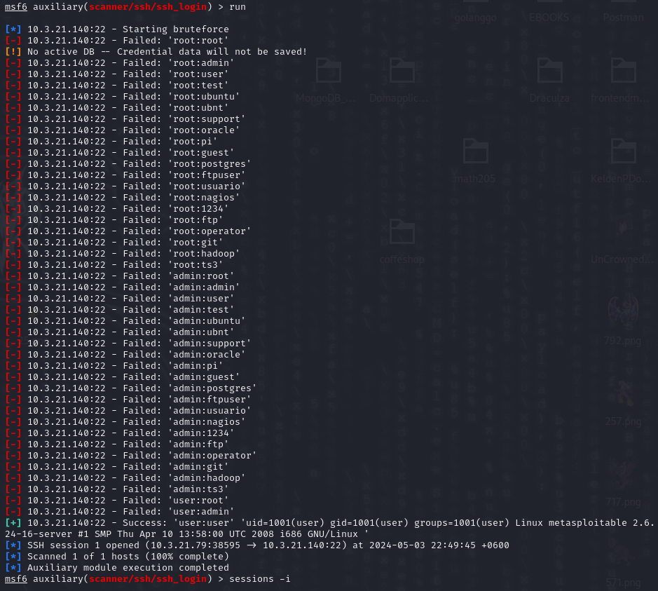
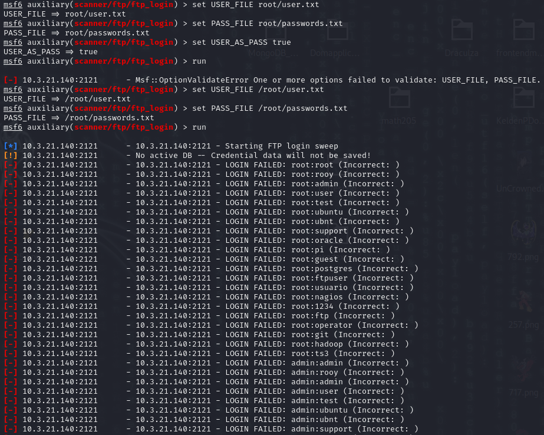

# CAP I: Network Penetration Testing

## Introduction

The CAP1 for SWS101 includes performing a penetration test on a server deployed within the College Network and submission of an engagement report.

As a Senior Penetration Tester working in RUB, you are tasked with assessing the security of a new server set up by one of the lecturers. The server is about to be released on the internet and needs to undergo thorough testing before its release.

Your mission is to leave no stone unturned:
- Find all ways to get into the server: Examine all ports and identify vulnerabilities.
- Find all ways to escalate privilege to root: Identify all possible methods to gain root access.
- Submit a comprehensive report of your findings to the head ICT officer of RUB.

## Instructions

Make sure you are in GCBS college’s network - the server isn’t available from the Internet like Bmobile or TashiCell. 
The server’s IP address is 10.3.21.140
Note: If the IP address changes, the new IP address will be announced in Google Space Chat and updated in the document here.
Just like the practicals in SWS101 till midterms on HackTheBox and TryHackMe machines, you are tasked to get into this server.

# Executive Summary

In this network penetration test CAP, i did a thorough examination of the target network to identify vulnerabilities and assess the overall security posture. The assessment included the use of various tools such as Nmap, Metasploit, Hydra, Gobuster, Nikto, and SQLmap to identify potential vulnerabilities and exploit them.

## Approach

### Methodology
My approach to assessing the network security involved a combination of automated tools and manual testing methods to identify vulnerabilities and weaknesses in the network infrastructure.

### Tools attempted & Scope
- Nmap
To identify active hosts on the net,port scanning and attempting to determine the operating system of the RHOST

- Metasploit
To exploit the known vulnerabilities in the RHOST and deliver payloads to gain root access.

- Hydra
To crack passwords through Brute-Force Attacks. 

- Gobuster
To discover hidden directories and files on the RHOST.

- Nikto
To find various security issues like outdated software, specific server issues, and other vulnerabilities in web servers.

- SQLmap
To automate the process of exploiting SQL injection vulnerabilities in a web application's database.

## Assessment Overview and Recommendations

### Findings
- Multiple critical vulnerabilities were discovered, including:
  - SQL injection in the web application, allowing unauthorized access to the database.
  - Default credentials on network devices, allowing for easy unauthorized access.
  - Missing security patches on critical servers, leaving them vulnerable to known exploits.
- These vulnerabilities could lead to unauthorized access, data breaches, and disruption of services.

### Recommendations
- Immediately patch all systems and applications to mitigate known vulnerabilities.
- Implement strong password policies and change default credentials on all network devices.
- Regularly conduct security assessments to identify and remediate vulnerabilities proactively.

## Network Penetration Test Assessment Summary

### Exploits Identified
- Exploit 1: PHP CGI Argument Injection
- Exploit 2: UnrealIRCd 3.2.8.1 Backdoor Command Execution
- Exploit 3: PostgreSQL Payload Execution
- Exploit 4: VSFTPD 2.3.4 Backdoor Command Execution
- Exploit 5: "username map script" Command Execution
- Exploit 6: SSH Brute Force Login
- Exploit 7: PostgreSQL Brute Force Login
- Exploit 8: MySQL Version Detection
- Exploit 9: SMTP User Enumeration
- Exploit 10: Telnet Brute Force Login
- Exploit 11: RPCbind Port 111 Privilege Escalation Attack 
- Exploit 12: Ingreslock
- Exploit 13: Java RMI Server Insecure Deserialization
- Exploit 14: FTP Brute Force Login
- Exploit 15: VNC Brute Force Login
- Exploit 16: Apache Tomcat Ghostcat Vulnerability
- Exploit 17: Remote Shell (rsh) Brute Force Login

## Network Compromise Walkthrough
- Exploit 1: PHP CGI Argument Injection(Port 80 HTTP)

Module Name: exploit/multi/http/php_cgi_arg_injection

This module exploits a vulnerability in PHP CGI when run as a FastCGI process. The vulnerability allows an attacker to execute arbitrary code by injecting specially crafted arguments in the query string. An attacker can use this vulnerability to execute arbitrary code and compromise the target system.

First, I searched on the Common Vulnerabilities and Exposures (CVE) website and Google to identify any known vulnerabilities affecting the PHP version. Next, using Metasploit's auxiliary modules, I confirm the versions of Apache and PHP running on the target machine. With this information, I use the search command in Metasploit to access exploits and proof of concepts from the "exploitdb.com" repository, targeting specific vulnerabilities in Apache and PHP. Upon identifying a relevant exploit such as exploit/multi/http/php_cgi_arg_injection for PHP, I configure the exploit to create an interactive shell, allowing me to explore the target machine and execute commands. Finally, I execute the exploit to gain remote access to the vulnerable machine and confirm the compromise through various commands, verifying elevated privileges if obtained.

- Exploit 2: UnrealIRCd 3.2.8.1 Backdoor Command Execution(Port 6667 smd 6697 UnrealIRCd)

Module Name: exploit/unix/irc/unreal_ircd_3281_backdoor

This module exploits a backdoor in UnrealIRCd 3.2.8.1 and earlier versions, which allows remote attackers to execute arbitrary IRC commands by using a crafted irc:// URI. This backdoor was present in the UnrealIRCd source code from November 2009 to June 12, 2010.

Unreal IRCd, an open-source IRC daemon, facilitates online communication. Despite its popularity, in 2009, version 3281 of Unreal IRCd's source distribution was compromised with a backdoor, exposing users to vulnerabilities for seven months. To exploit this, we use the Metasploit Framework, ensuring the PostgreSQL service is active before launching Metasploit. With "msfconsole," we search for Unreal IRCd vulnerabilities and select the "unreal ircd 3.2.81 backdoor" exploit. Configuring the exploit, we set the remote host IP and choose the "bind ruby" payload to gain control over the vulnerable machine. Executing the exploit grants us command shell access, allowing verification of obtained privileges with commands like "whoami" and extraction of encrypted passwords from the shadow file.

Using another payload

- Exploit 3: PostgreSQL Payload Execution(Port 5432 postgresql)

Module Name: exploit/linux/postgres/postgres_payload

This module generates and executes a payload against a PostgreSQL server. It allows an attacker to execute arbitrary commands on the target system by exploiting vulnerabilities in the PostgreSQL server.

- Exploit 4: VSFTPD 2.3.4 Backdoor Command Execution(Port 21 FTP)

Module Name: exploit/unix/ftp/vsftpd_234_backdoor

This module exploits a backdoor in VSFTPD version 2.3.4. The backdoor was introduced into the VSFTPD source code in July 2011. By sending a specific user name in combination with a smiley face as a password, an attacker can execute arbitrary commands on the target system.

- Exploit 5: "username map script" Command Execution(Port 139 and 445 SMB)

Module Name: exploit/multi/samba/usermap_script

This module exploits a command execution vulnerability in Samba versions 3.0.20 through 3.0.25rc3 when the "username map script" parameter is enabled in the smb.conf file. By sending a specially crafted request, an attacker can execute arbitrary commands with the privileges of the Samba server.

- Exploit 6: SSH Brute Force Login(Port 22 SSH)

Module Name: auxiliary/scanner/ssh/ssh_login

This module performs a brute force attack against SSH servers to guess login credentials. It tries a list of usernames and passwords against a given SSH server to gain unauthorized access.

- Exploit 7: PostgreSQL Brute Force Login(Port 5432 postgresql)

Module Name: auxiliary/scanner/postgres/postgres_login

This module performs a brute force attack against PostgreSQL servers to guess login credentials. It tries a list of usernames and passwords against a given PostgreSQL server to gain unauthorized access.

- Exploit 8: MySQL Version Detection(Port 3306 MySQL)

Module Name: auxiliary/scanner/mysql/mysql_version

This module detects the version of the MySQL service running on the target host. It sends a version request and analyzes the response to determine the MySQL version.

- Exploit 9: SMTP User Enumeration(Port 25 SMTP)

Module Name: auxiliary/scanner/smtp/smtp_enum

This module performs user enumeration against SMTP servers. It attempts to enumerate valid usernames by trying various combinations of usernames against the SMTP server and analyzing the response.

- Exploit 10: Telnet Brute Force Login(Port 23 Telnet)

Module Name: auxiliary/scanner/telnet/telnet_login

This module performs a brute force attack against Telnet servers to guess login credentials. It tries a list of usernames and passwords against a given Telnet server to gain unauthorized access.

- Exploit 11: RPCbind Port 111 Privilege Escalation Attack(Ports 111 and 2049 rpcbind nfs)

Nmap scan confirms ports 111 (RPC bind) and 2049 (NFS) are open.
Use rpcinfo to check RPC services.
Identify NFS-related services running on port 2049.
Use showmount -a to check NFS server status.
Discover root file system can be mounted.
Generate SSH key pair on attacking machine using ssh-keygen.
Mount Metasploitable's root file system on the attacking machine.
Copy attacker's public key to authorized_keys file.
Use ssh command to connect to Metasploitable using a private key.
Gain root privileges on Metasploitable.
Verify privileges with commands like whoami.
Extract root user's encrypted passwords from shadow file.

- Exploit 12: Ingreslock(Port 1524 Ingreslock)

'telnet 10.3.21.140 1524' attempts to connect to a service running on your local machine (10.3.21.140) on port 1524 using the Telnet protocol.

- Exploit 13: Java RMI Server Insecure Deserialization(Ports 1099 and 49104 java rmi)

Module Name: exploit/multi/misc/java_rmi_server(Ports 1099 49104 java rmi)

This module exploits insecure deserialization in Java RMI servers. By sending a specially crafted serialized object to the RMI server, an attacker can execute arbitrary code on the target system.

- Exploit 14: FTP Brute Force Login(Port 21 FTP)

Module Name: auxiliary/scanner/ftp/ftp_login

This module performs a brute force attack against FTP servers to guess login credentials. It tries a list of usernames and passwords against a given FTP server to gain unauthorized access.

- Exploit 15: VNC Brute Force Login(Port 5900 VNC)

Module Name: auxiliary/scanner/vnc/vnc_login

This module performs a brute force attack against VNC servers to guess login credentials. It tries a list of usernames and passwords against a given VNC server to gain unauthorized access.

- Exploit 16: Apache Tomcat Ghostcat Vulnerability(Port 8009 AJP)

Module Name: auxiliary/admin/http/tomcat_ghostcat

This module exploits the Ghostcat vulnerability (CVE-2020-1938) in Apache Tomcat. By sending a specially crafted request, an attacker can read files from a server or carry out remote code execution.

- Exploit 17: Remote Shell (rsh) Brute Force Login(Port 514 Shell)

Module Name: auxiliary/admin/rservices/rsh_logina

This module performs a brute force attack against rsh (Remote Shell) servers to guess login credentials. It tries a list of usernames and passwords against a given rsh server to gain unauthorized access.

## Remediation Summary

- Exploit 1: PHP CGI Argument Injection (Port 80 - HTTP)

Update PHP to the latest version to patch the CGI argument injection vulnerability.
Regularly monitor the Common Vulnerabilities and Exposures (CVE) website and other relevant sources for PHP vulnerabilities and security patches.
Implement a web application firewall (WAF) to filter and block malicious requests targeting PHP vulnerabilities.
Harden the web server configuration to restrict access to sensitive files and directories.

- Exploit 2: UnrealIRCd 3.2.8.1 Backdoor Command Execution (Ports 6667 and 6697 - UnrealIRCd)

Upgrade to a patched version of UnrealIRCd to remove the backdoor.
Verify the integrity of the UnrealIRCd installation to ensure no malicious modifications have been made.
Regularly monitor the UnrealIRCd website and security advisories for any new vulnerabilities and updates.
Implement network segmentation to isolate the IRC server from critical systems and sensitive data.

- Exploit 3: PostgreSQL Payload Execution (Port 5432 - PostgreSQL)

Ensure PostgreSQL is up to date with the latest security patches.
Implement strong password policies for PostgreSQL user accounts.
Enable network encryption (SSL/TLS) for PostgreSQL connections to protect against eavesdropping and man-in-the-middle attacks.

- Exploit 4: VSFTPD 2.3.4 Backdoor Command Execution (Port 21 - FTP)

Upgrade to a patched version of VSFTPD to remove the backdoor.
Regularly monitor the VSFTPD website and security advisories for any new vulnerabilities and updates.
Implement network segmentation to isolate the FTP server from critical systems and sensitive data.
Use strong FTP user credentials and implement account lockout policies to mitigate brute force attacks.

- Exploit 5: "username map script" Command Execution (Ports 139 and 445 - SMB)

Disable the "username map script" parameter in the smb.conf file.
Regularly audit the Samba configuration for any misconfigurations and vulnerabilities.
Implement network segmentation to isolate the Samba server from critical systems and sensitive data.
Use strong Samba user credentials and implement account lockout policies to mitigate brute force attacks.

- Exploit 6: SSH Brute Force Login (Port 22 - SSH)

Use strong SSH user credentials and implement account lockout policies to mitigate brute force attacks.
Implement two-factor authentication (2FA) for SSH access to add an extra layer of security.
Monitor SSH logs for failed login attempts and implement automated blocking of IP addresses with multiple failed login attempts.
Regularly update and patch the SSH server to protect against known vulnerabilities.

- Exploit 7: PostgreSQL Brute Force Login (Port 5432 - PostgreSQL)

Use strong PostgreSQL user credentials and implement account lockout policies to mitigate brute force attacks.
Implement network encryption (SSL/TLS) for PostgreSQL connections to protect against eavesdropping and man-in-the-middle attacks.
Regularly monitor PostgreSQL logs for failed login attempts and implement automated blocking of IP addresses with multiple failed login attempts.
Regularly update and patch PostgreSQL to protect against known vulnerabilities.

- Exploit 8: MySQL Version Detection (Port 3306 - MySQL)

Regularly update and patch MySQL to protect against known vulnerabilities.
Implement strong MySQL user credentials and implement account lockout policies to mitigate brute force attacks.
Enable network encryption (SSL/TLS) for MySQL connections to protect against eavesdropping and man-in-the-middle attacks.
Implement network segmentation to isolate the MySQL server from critical systems and sensitive data.

- Exploit 9: SMTP User Enumeration (Port 25 - SMTP)

Implement rate limiting and account lockout policies to mitigate brute force attacks.
Regularly monitor SMTP logs for suspicious activity, such as multiple failed login attempts.
Configure SMTP servers to provide limited information in response to invalid user login attempts to prevent user enumeration.
Regularly update and patch SMTP servers to protect against known vulnerabilities.

- Exploit 10: Telnet Brute Force Login (Port 23 - Telnet)

Disable the Telnet service and use SSH instead, which provides stronger security.
Implement strong SSH user credentials and implement account lockout policies to mitigate brute force attacks.
Monitor Telnet logs for failed login attempts and implement automated blocking of IP addresses with multiple failed login attempts.
Regularly update and patch the Telnet server to protect against known vulnerabilities.

- Exploit 11: RPCbind Port 111 Privilege Escalation Attack (Ports 111 and 2049 - RPCbind/NFS)

Disable unnecessary RPC services and protocols to reduce the attack surface.
Implement firewall rules to restrict access to RPC services from trusted hosts and networks.
Regularly update and patch the RPC services and NFS to protect against known vulnerabilities.
Implement network encryption (SSL/TLS) for NFS connections to protect against eavesdropping and man-in-the-middle attacks.

- Exploit 12: Ingreslock (Port 1524 - Ingreslock)

Disable the Ingreslock service if it is not required.
Implement network segmentation to isolate the Ingreslock service from critical systems and sensitive data.
Regularly update and patch the Ingreslock service to protect against known vulnerabilities.
Monitor Ingreslock logs for suspicious activity and unauthorized access attempts.

- Exploit 13: Java RMI Server Insecure Deserialization (Ports 1099 and 49104 - Java RMI)

Disable or restrict access to the Java RMI service if it is not required.
Implement network segmentation to isolate the Java RMI service from critical systems and sensitive data.
Regularly update and patch the Java RMI service to protect against known vulnerabilities.
Monitor Java RMI logs for suspicious activity and unauthorized access attempts.

- Exploit 14: FTP Brute Force Login (Port 21 - FTP)

Implement strong FTP user credentials and implement account lockout policies to mitigate brute force attacks.
Regularly monitor FTP logs for failed login attempts and implement automated blocking of IP addresses with multiple failed login attempts.
Implement network encryption (SSL/TLS) for FTP connections to protect against eavesdropping and man-in-the-middle attacks.
Regularly update and patch the FTP server to protect against known vulnerabilities.

- Exploit 15: VNC Brute Force Login (Port 5900 - VNC)

Implement strong VNC user credentials and implement account lockout policies to mitigate brute force attacks.
Regularly monitor VNC logs for failed login attempts and implement automated blocking of IP addresses with multiple failed login attempts.
Implement network encryption (SSL/TLS) for VNC connections to protect against eavesdropping and man-in-the-middle attacks.
Regularly update and patch the VNC server to protect against known vulnerabilities.

- Exploit 16: Apache Tomcat Ghostcat Vulnerability (Port 8009 - AJP)

Upgrade to Apache Tomcat version 9.0.31, 8.5.51, or 7.0.100 or later to patch the Ghostcat vulnerability (CVE-2020-1938).
Disable the AJP connector if it is not required.
Implement network segmentation to isolate the Apache Tomcat server from critical systems and sensitive data.
Regularly update and patch Apache Tomcat to protect against known vulnerabilities.

- Exploit 17: Remote Shell (rsh) Brute Force Login (Port 514 - RSH)

Disable the RSH service if it is not required.
Implement strong RSH user credentials and implement account lockout policies to mitigate brute force attacks.
Regularly monitor RSH logs for failed login attempts and implement automated blocking of IP addresses with multiple failed login attempts.
Regularly update and patch the RSH server to protect against known vulnerabilities.

