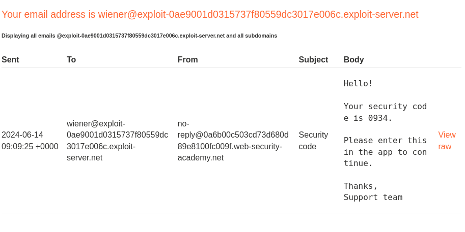
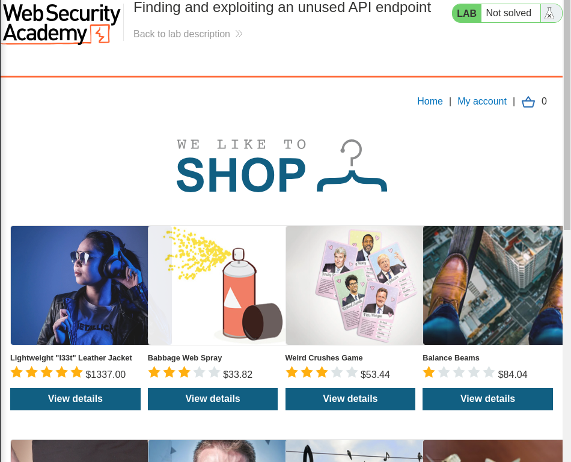
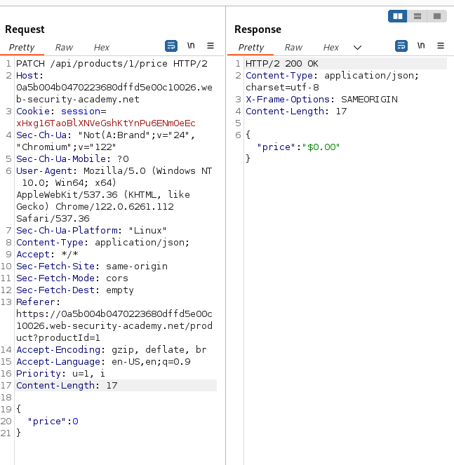
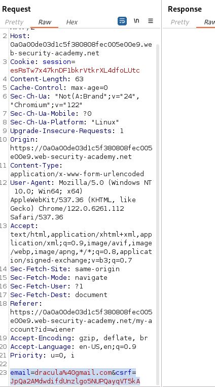
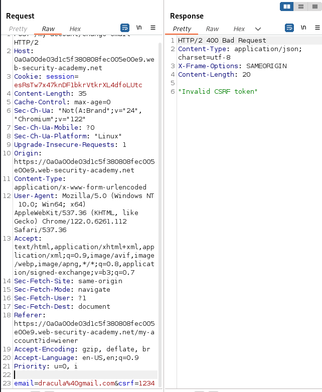
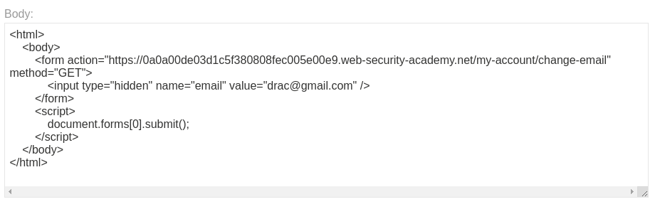

# CAP III: Bug Bounty Case Study

# Authentication

## Lab 1: 2FA simple bypass (APPRENTICE)

What is the lab about (what does the lab want you to learn):
This lab teaches you how to bypass a two-factor authentication mechanism by exploiting a weakness in the implementation. The goal is to access Carlos's account page without having his 2FA verification code.

Steps to reproduce (with screenshots):

Access the Lab:
Open the lab and navigate to the login page.

Retrieve Username and Password:
Note down the provided username and password for accessing the account.

Your credentials: wiener:peter
Victim's credentials: carlos:montoya
Login to the Application:
Input the provided username and password in the appropriate fields, and then click on the "Login" button.

Obtain Client-Side Security Code: From the client-side, retrieve the four-digit security code and copy it.

Enter Security Code: Return to the application and enter the copied security code in the designated field, then click on the "Login" button.

Copy URL: Copy the URL after successfully logging in and accessing the account page.

Logout and Prepare for Victim Account Access: Log out from the current account and paste the copied URL in the browser.

Access Victim's Account: Modify the username in the URL to the victim's username and hit "Enter" to access the victim's account page.

Replace Password: Replace the victim's password in the URL with the new password and hit "Enter" to submit the new password.

Verify Access: Confirm that the lab access is acquired by observing the successful access to the victim's account.
How can the vulnerability be fixed: To fix this vulnerability, the application should:

Ensure the 2FA code is verified on the server side.
Implement rate limiting to prevent brute-force attacks.
Use a secure method for generating and verifying 2FA codes to ensure they are unique and expire after a short period.

## Lab 2: Password reset broken logic (APPRENTICE)

What is the lab about (what does the lab want you to learn):
This lab demonstrates how vulnerabilities in the password reset functionality can be exploited to gain unauthorized access to a user account. The objective is to reset Carlos's password and access his "My account" page.

Steps to reproduce (with screenshots):

Enable Proxy: Ensure that the proxy is turned on (e.g., Burp Suite).

Access the Lab: Navigate to the lab and go to the "My Account" section.

Copy Credentials: Note down the conditional requirements, including the winner username, the password reader, and the victim user "carlos".

Your credentials: wiener:peter
Victim's username: carlos
Reset Password:
Proceed to the "Forgot Password" section. Input the "wiener" username and proceed to the email client to click the provided link.

Set a new password, such as "1234," and submit the request.

In Burp Suite, locate the HTTP history and search for the "forget password" request. Send this request to the repeater.

Within the repeater, remove the token and password fields and resend the request. A "300 found" response indicates that the request has been accepted without the token.

Further Request Modification:
Go back to the "Forget Password" section in the lab, and utilize the "wiener" username. Access the email client and click the link, then input the new password.

Use Burp Suite Repeater Again:
In Burp Suite, navigate to the HTTP history and find the new "POST" request for the forget password section. Send this to the repeater.

Replace Username and Send Request:
In the repeater, substitute the "wiener" username with "carlos." Send the modified request.

Validate Access:
Navigate back to the website, go to the "My Account" section, and input the username "Carlos" with the password "1234." Access should be granted, and the lab is solved.

How can the vulnerability be fixed:
To fix this vulnerability, the application should:

Ensure that the password reset token is verified server-side before allowing a password change.
Implement proper session management to prevent unauthorized password reset requests.
Use a secure, random, and unique token for each password reset request to ensure it cannot be easily guessed or bypassed.

# API testing

## Lab 1: Exploiting an API endpoint using documentation (APPRENTICE)

What is the lab about (what does the lab want you to learn):
This lab focuses on discovering and exploiting an API endpoint documented within the application to manipulate user data. The goal is to use the exposed API documentation to delete the user "carlos."

Steps to reproduce (with screenshots):

Use the provided credentials to log in:

Username: wiener
Password: peter

Explore application structure:
Navigate to different pages and endpoints within the application to understand its structure and functionality.

Discover API endpoint for changing user information:
Discover an endpoint related to changing user information, such as the "change email" functionality, which typically uses a "PATCH" method and requires a JSON body to update the email address.

Introspect requests using Burp Suite:
Use tools like Burp Suite to intercept and introspect the requests and responses to the discovered API endpoints.
Identify hidden API documentation:
Manipulate the endpoint URL or explore related URLs to identify hidden API documentation. Look for available methods such as GET, DELETE, PATCH, etc.

Test discovered API endpoints:
Test the discovered API endpoints to understand their functionality. Focus on exploiting the "DELETE" method to delete a specific user named "carlos."

Verify successful deletion:
After sending the DELETE request, verify the successful deletion of the user by checking the status and confirming that the specified user "carlos" has been removed from the backend.

Completion:
Upon successful completion of the steps, the lab will be solved, demonstrating your ability to exploit an API endpoint and manipulate user data effectively.

Conclusion:
This lab underscores the importance of understanding API documentation and security implications. It illustrates how to responsibly explore and utilize documented endpoints for legitimate testing purposes.

How can the vulnerability be fixed:
To mitigate such vulnerabilities, the application should:

Ensure that API documentation is properly secured and accessible only to authorized users.
Implement strong authentication and authorization mechanisms for API endpoints to prevent unauthorized access and manipulation of sensitive data.
Regularly review and update API documentation to remove any unintended exposures or outdated information that could lead to exploitation.

## Lab 2: Finding and exploiting an unused API endpoint (PRACTITIONER)

What is the lab about (what does the lab want you to learn):
This lab aims to demonstrate the exploitation of a hidden or unused API endpoint within the application to manipulate the pricing of products and obtain a "Lightweight L33t Leather Jacket" for free.

Steps to reproduce (with screenshots):

Use the provided credentials to log in:

Username: wiener
Password: peter

Examine application functionality:After logging in, examine the functionality of the application. Note that there is a store credit of $0.

Add "Lightweight L33t Leather Jacket" to cart:Proceed to add the "Lightweight L33t Leather Jacket" to the cart.

Navigate to cart and attempt to place order:Navigate to the cart and attempt to place an order for the jacket. Observe the error message indicating "not enough store credit for this purchase."

Intercept and modify requests using Burp Suite:Utilize a proxy tool like Burp Suite to intercept and modify the requests sent to the server.

Explore API endpoints:Explore the API endpoints within the application to identify the endpoint related to the pricing of products.

Modify price of "Lightweight L33t Leather Jacket":Submit a modified request changing the price of the "Lightweight L33t Leather Jacket" to $0 using the identified API endpoint.

Verify price change and place order:Verify that the price of the jacket has been changed to $0 successfully. Proceed to place the order again.

Confirm successful completion:Upon successful submission, confirm the completion of the lab by checking the order status or viewing the purchased item in your account.

Conclusion:This lab highlights the risks associated with unused or hidden API endpoints that can be exploited for unintended purposes. It emphasizes the importance of thorough testing and securing all application endpoints, including those not actively used.

How can the vulnerability be fixed:
To mitigate such vulnerabilities, the application should:

Regularly review and audit all API endpoints to identify and remove unused or unnecessary endpoints.
Implement proper authentication, authorization, and validation mechanisms for all API requests to prevent unauthorized access and manipulation of sensitive data.
Ensure that sensitive operations such as price adjustments are adequately protected and logged to detect and respond to potential abuse or exploitation.

# Cross-Site Request Forgery (CSRF)

## Lab 1: CSRF vulnerability with no defenses (APPRENTICE)

What is the lab about (what does the lab want you to learn):
This lab demonstrates the exploitation of a CSRF (Cross-Site Request Forgery) vulnerability in the email change functionality of an application. The objective is to craft a malicious HTML page that, when visited by a victim, automatically changes their email address without their consent.

Steps to reproduce (with screenshots):

Log in using the provided credentials:

Username: wiener
Password: peter

Identify "update email" form:Identify an "update email" form within the application that allows users to change their email addresses.

Intercept the request using Burp Suite:Use a proxy tool like Burp Suite to intercept the request when updating the email address. Analyze the request parameters and structure.
Ensure to replace "https://victim-site.com/myaccount/changeemail" with the actual endpoint and provide a valid CSRF token if necessary.
Host the crafted HTML page on an exploit server. Ensure the page is accessible via a URL.

Convince the victim to visit the exploit server:Share the link to the exploit server with the victim through social engineering tactics or other means.

When the victim visits the exploit server and the crafted HTML page, the form is automatically submitted due to the embedded JavaScript. The victim's email address is changed to the attacker's specified email (attacker@example.com) without their consent.

Confirm successful email change:
Confirm the successful email change by checking the email address associated with the victim's account in the application.

Conclusion:
This lab highlights the security risk posed by CSRF vulnerabilities, where attackers can forge requests on behalf of authenticated users. It emphasizes the importance of implementing CSRF defenses such as CSRF tokens to prevent unauthorized actions.

How can the vulnerability be fixed:
To mitigate CSRF vulnerabilities, the application should:

Implement CSRF tokens that are unique per session and validated on each sensitive operation.
Ensure that sensitive operations like email changes require additional authentication or confirmation steps.
Educate users about the risks of clicking on unfamiliar links and encourage safe browsing practices to prevent CSRF attacks.

## Lab 2: CSRF where token validation depends on request method (PRACTITIONER)

What is the lab about (what does the lab want you to learn):
This lab demonstrates a CSRF vulnerability where the application's email change functionality attempts to defend against CSRF attacks but only applies defenses to certain request methods. The objective is to exploit this vulnerability by crafting an HTML page that changes the viewer's email address through a GET request, bypassing CSRF token protection.

Steps to reproduce (with screenshots):

Log in to the lab using the provided credentials:

Username: wiener
Password: peter

Capture and modify requests with Burp Suite:
Turn on interceptors in Burp Suite to capture and modify requests. Start by identifying the request responsible for updating the email address.

Understand request parameters:
Update the email parameter in the captured request to understand how changing its value affects the request. Note the presence of any CSRF tokens and their behavior based on the request method (POST vs GET).

Change request method to GET:
Experiment by changing the request method from POST to GET and observe any differences in the application's behavior or response.

Craft malicious HTML page:
Create an HTML page that sends a GET request to change the email address.

Ensure to replace "https://victim-site.com/myaccount/changeemail" with the actual endpoint and provide the victim's email address (attacker@example.com).

Test the crafted payload on your own account to confirm that the attack works successfully when using a GET request.

Modify the payload to include a different email address and host it on your exploit server. Share the link to the exploit server with the victim to observe the attack on their account.

Recognize that the vulnerability, where CSRF tokens are not required for GET requests, can lead to unauthorized state changes such as changing the email address of the victim without their consent.

Learn from the lab the importance of implementing secure methods such as CSRF tokens that are validated for all sensitive operations, regardless of the request method. Implement these methods in future applications to prevent CSRF attacks.

This lab underscores the risks associated with CSRF vulnerabilities that depend on request method validation. It emphasizes the need for consistent CSRF protection across all operations within an application to mitigate unauthorized state changes.

How can the vulnerability be fixed:
To mitigate CSRF vulnerabilities effectively, the application should:

Implement CSRF tokens that are unique per session and validated on all sensitive operations, regardless of the request method.
Ensure that all state-changing operations require CSRF tokens to prevent attackers from forging requests and manipulating user data.
Conduct regular security reviews and testing to identify and fix potential CSRF vulnerabilities before they can be exploited.

## Lab 3: SameSite Lax bypass via method override (PRACTITIONER)

What is the lab about (what does the lab want you to learn):
This lab demonstrates how SameSite Lax attributes on cookies can be bypassed to perform a CSRF attack. The objective is to exploit this vulnerability to change the victim's email address using a method override technique, where a POST request is sent disguised as a GET request.

Steps to reproduce (with screenshots):

Ensure you are using a Chrome-based browser as the victim for the lab. Chrome automatically sets the SameSite attribute of the session cookie to 'Lax' after two minutes of logging in.
Initial Email Change Attempt:

Log in to the web application using the provided credentials:
Username: wiener
Password: peter
Observe the victim's current email address (e.g., 'wiener@normaluser.net').
Attempt to change the email address to a different one (e.g., 'wiener@abnormaluser.net').
Identifying CSRF Vulnerability:

Analyze the POST request generated when changing the email address to look for potential CSRF vulnerabilities.
Note any absence of CSRF protection measures, such as CSRF tokens in the request.
Session Cookie Details:

Review the session cookie details to understand its attributes, including SameSite, Secure, expiry date, etc.
SameSite Attribute Implication:

Understand that Chrome automatically sets the SameSite attribute to 'None' after two minutes, potentially creating a security vulnerability.
Creating the CSRF PoC:

Generate a Cross-Site Request Forgery (CSRF) Proof of Concept (PoC) using tools or custom code to exploit the vulnerability.
Exploit Delivery Attempt:

Craft the exploit payload to change the email address to a specific value (e.g., 'Wienerschnitzel').
Ensure the method of the exploit request is set to POST.
Send the exploit to the victim to trigger the CSRF attack.
Check for indications that the email address changed successfully, confirming the success of the attack.
Handling SameSite Attribute Limitation:

Understand that attempting to change the method to GET to circumvent the SameSite attribute restriction results in a 'Method Not Allowed' error due to the application's security measures.
Leveraging Method Spoofing:

Explore method spoofing as a workaround that allows sending a POST request hidden within a GET request.
Utilize the hidden parameter _method to trick the web framework into interpreting the request as a POST request.
Exploiting Method Spoofing:

Configure the exploit to send a GET request with a hidden _method parameter indicating 'POST' to simulate the desired behavior.
Send the modified exploit to the victim to carry out the attack.
Verification of Successful Lab Completion:

Confirm that the lab has been solved successfully by verifying the email address change on the victim's account post-exploit delivery.
Conclusion:
This lab underscores the importance of understanding and mitigating CSRF vulnerabilities, especially when SameSite cookie attributes are involved. It highlights how method override techniques can be used to bypass security restrictions and perform unauthorized actions.

How can the vulnerability be fixed:
To mitigate CSRF vulnerabilities effectively in scenarios involving SameSite attributes:

Implement strong CSRF protections such as unique tokens per session and validate them on all state-changing operations.
Consider setting the SameSite attribute to 'Strict' or 'None' (with Secure) based on the application's requirements and security considerations.
Regularly review and update security practices to address evolving threats and vulnerabilities in web applications.

# Access Control Vulnerabilities

## Lab 1: Unprotected admin functionality (APPRENTICE)

What is the lab about (what does the lab want you to learn):
This lab teaches you how to identify and exploit unprotected admin functionalities. The goal is to delete the user "carlos" by accessing an admin panel that lacks proper access control.

Steps to reproduce (with screenshots):

Access the Lab:Navigate to the lab containing the "Unprotected Admin Functionality" to delete the user "carlos".
Access Admin Panel:Initially, try accessing the admin panel directly by typing /admin or /ADM in the URL, but it returns a "Not Found" error.

Explore robots.txt:Check the robots.txt file by appending /robots.txt to the base URL to find any disallowed directories.
Identify Admin Panel URL:In the robots.txt file, discover a disallowed directory containing the admin panel URL.
Access Admin Panel:Copy the discovered admin panel URL and paste it in the browser to access the admin panel directly without any authentication.

Delete User:As there is no authentication or authorization control on the admin panel, proceed to delete the user "carlos" as instructed.

Confirm Deletion:
Once the deletion is successful, you have solved the lab by bypassing the broken access control to delete the user "Carlos" without proper authorization.

Understand Broken Access Control:This lab demonstrates a broken access control vulnerability, where the admin panel is unprotected, allowing any user to manipulate user accounts without proper authentication.

How can the vulnerability be fixed:
To fix this vulnerability, the application should:
Implement proper authentication and authorization checks for accessing admin functionalities.
Ensure sensitive directories and files are not listed in the robots.txt file or are properly protected if they must be listed.
Regularly audit access control mechanisms to ensure no endpoints are exposed without proper security measures.

## Lab 2: Unprotected admin functionality with unpredictable URL (APPRENTICE)

What is the lab about (what does the lab want you to learn):
This lab teaches you how to identify and exploit unprotected admin functionalities that are located at unpredictable URLs. The goal is to find the hidden admin panel and delete the user "carlos."

Steps to reproduce (with screenshots):

Navigate to the lab labeled "Unprotected Admin Functionality with Unpredictable URL" and start the challenge.

Explore Unpredictable Admin Panel:
Initially, attempt to access the admin panel by guessing the URL, trying paths like /admin or /admin_panel, but find that the admin panel location is unpredictable.

Use the shortcut "Ctrl + U" to view the page source code and search for any clues regarding the location of the admin panel.

In the page source code, perform a search (Ctrl + F) for the term "admin" to identify any references to the admin panel.

Discover a link within the page source code that likely corresponds to the unpredictable location of the admin panel. Copy the URL for further use.

Paste the copied URL into the browser to access the unpredictable admin panel directly.
Remove User:
Once access is obtained, proceed to use the admin panel functionality to delete the specified user "carlos" as per the lab requirements.

After successfully deleting the user "carlos" using the unpredictable admin panel URL, you have completed the lab. This demonstrates the importance of thoroughly examining the source code to discover hidden functionalities or locations.

How can the vulnerability be fixed:
To fix this vulnerability, the application should:
Implement proper authentication and authorization checks for accessing admin functionalities.
Avoid including sensitive URLs or endpoints in the page source code.
Regularly audit access control mechanisms to ensure no endpoints are exposed without proper security measures.

## Lab 3: User role controlled by request parameter (APPRENTICE)

What is the lab about (what does the lab want you to learn):
This lab demonstrates how vulnerabilities in user role management and access control can be exploited. The objective is to gain unauthorized access to an admin panel by manipulating a forgeable cookie, and then delete the user "carlos".

Steps to reproduce (with screenshots):

Access the Lab:
Navigate to the lab titled "User Controlled by Request Parameter," which falls under the category of Broken Access Control.

Identify Admin Panel:
The admin panel is found to be directly accessible at /admin, but it is restricted from direct use.

Examine Lab Instructions:
Review the lab instructions, which state that the admin panel is located at /admin and that the administrator user is identified using a forgeable cookie.
Obtain Credentials:
Use the provided credentials to log in:

Username: wiener
Password: peter
Authentication:
Log in using the "wiener" username and "peter" password to gain access.

Access Admin Panel - Denied:
Attempting to access /admin directly results in a message stating that the admin interface is only available if logged in as an administrator.

Inspect Cookies:
Use the browser's Developer Tools to inspect the cookies and find a parameter named admin with a value of false, indicating non-administrator status.

Forge Cookie Value:
Change the admin cookie value to true to escalate privileges and indicate administrator status.

Reload Page:
After modifying the cookie, refresh the page to apply the updated cookie value.

Successful Access:
After the page reloads, the admin panel is now accessible, demonstrating successful privilege escalation by manipulating the cookie parameter.

Complete the Lab:
Delete the user "carlos" using the admin panel, and the lab is successfully solved.

The lab demonstrates the concept of privilege escalation and broken access control, showcasing the significance of proper access restrictions and user identification.

How can the vulnerability be fixed:
To fix this vulnerability, the application should:

Ensure that user roles and access permissions are managed server-side rather than client-side.
Implement secure session management practices to prevent cookie tampering.
Regularly audit access control mechanisms to ensure they properly enforce authorization checks.

# Business logic vulnerabilities

## Lab 1: Inconsistent security controls (APPRENTICE)

What is the lab about (what does the lab want you to learn):
This lab demonstrates the exploitation of inconsistent security controls that allow unauthorized access to administrative functionalities. The goal is to access the admin panel and delete the user "carlos".

Steps to reproduce (with screenshots):

Register for an account using an email address with the domain "drac" (or specified domain for employees of "Don't Wanna Cry").

Complete Registration:
Use a password of your choice and complete the registration process.

Check for the account registration link in your email and click on it to verify your account.

Log in to the account using the credentials created during registration.

Access "Update Email" Functionality:
Navigate to the "Update Email" functionality within the account settings.

Change Email Address:
Change the email address to one using the domain "donotcry.com" (e.g., drac@donotcry.com).

Update Email without Verification:
Update the email address without requiring any email verification.

Verify Access to Admin Panel:
Verify that the email update was successful by checking for additional functionality or access to an admin panel.

Access Admin Panel:
Access the admin panel now available due to the inconsistent security controls.

Delete User "Carlos":
Once in the admin panel, delete the user named "Carlos" to complete the lab.
The lab illustrates the risks associated with inconsistent security controls, emphasizing the importance of ensuring consistent and robust access management practices.

How can the vulnerability be fixed:
To fix this vulnerability, the application should:

Implement consistent access control mechanisms that properly validate user roles and permissions.
Ensure that critical administrative functionalities are only accessible to authorized personnel.
Perform thorough security testing and audits to identify and rectify any inconsistencies in access controls.

## Lab 2: Flawed enforcement of business rules (APPRENTICE)
What is the lab about (what does the lab want you to learn):
This lab demonstrates a flaw in the purchasing workflow of an application where business rules are not properly enforced. The objective is to exploit this flaw to obtain a "Lightweight l33t leather jacket" for free.

Steps to reproduce (with screenshots):

Log in to your account using the provided credentials:

Username: wiener
Password: peter

Note available store credit and coupon:
Note that there is a store credit of $100 and a coupon code available.

Sign up for the newsletter:
Go to the home page and scroll down to the bottom. Sign up for the newsletter by inputting any email address and clicking "Sign up".

Receive new coupon code:
After signing up, a new coupon code ("sign up 30") will be provided.

Add the "Lightweight Leather Jacket" to your cart:
Navigate to the product page and add the "Lightweight Leather Jacket" to your cart.

Apply the first coupon code:
Go to your cart and apply the first coupon code provided. Notice a reduction of $5 in the total.

Apply the second coupon code:
Apply the second coupon code ("sign up 30") as well. Notice a further discount of 30% applied.

Experiment with coupon codes:
Experiment by alternating the application of the two coupon codes multiple times until the total price is reduced to zero or less than $100.

Proceed to checkout:
Once the price is reduced to zero, proceed to the checkout and place the order.

Congratulations!:
You have successfully exploited the logic flaw in the purchasing workflow and obtained the "Lightweight Leather Jacket" for free.

Conclusion:
The lab highlights the importance of properly enforcing business rules, especially in financial transactions and discounts, to prevent unauthorized exploitation.

How can the vulnerability be fixed:
To fix this vulnerability, the application should:

Implement robust validation and enforcement of business rules on the server side.
Ensure that discounts, coupon codes, and store credits are applied correctly and securely.
Conduct thorough testing and validation of the purchasing workflow to identify and mitigate logic flaws that could be exploited.

## Lab 3: Authentication bypass via flawed state machine (PRACTITIONER)

What is the lab about (what does the lab want you to learn):
This lab exposes a flaw in the authentication state machine of an application, allowing unauthorized access to administrative functionalities. The objective is to exploit this flaw to bypass authentication, access the admin interface, and delete the user "carlos."

Steps to reproduce (with screenshots):

Access the login page and enter the provided credentials:

Username: wiener
Password: peter

Intercept the login request:
Instead of selecting a role (content author or user) as required, intercept the login request using a tool like Burp Suite.
Modify the request:
In the intercepted request, remove the part that specifies the selected role (content author or user).

Forward the modified request:
Forward the modified request without a selected role and observe the response.

Successful authentication without role:
Notice that although the login process is incomplete (as there is no selected role), the authentication is successful. This grants elevated privileges akin to an admin.

Access the admin interface:
Navigate to the home page or admin interface to access additional functionality available to an admin.

Delete user "Carlos":
Locate and delete the user named "Carlos" as instructed to complete the lab successfully.

Conclusion:
The lab demonstrates the risk of flawed state machines in authentication processes, allowing unauthorized users to gain admin-level privileges.

How can the vulnerability be fixed:
To fix this vulnerability, the application should:

Ensure that authentication and authorization mechanisms are properly separated and enforced.
Validate all parameters and states in the authentication process to prevent bypass attempts.
Implement strong session management and role-based access controls to restrict privileges based on authenticated roles.